# 📸 KeJepret - Marketplace Foto Event Olahraga Berbasis AI Face Search

KeJepret adalah platform marketplace modern yang menjembatani **Fotografer Olahraga** untuk memonetisasi karya foto mereka dan **Pelari (Runner)** untuk menemukan foto aksi mereka secara instan menggunakan pencarian wajah berbasis kecerdasan buatan (*AI Face Search*).

---

## 🗺️ Arsitektur & Alur Kerja Utama Sistem

Sistem KeJepret dirancang untuk otomatisasi hulu-ke-hilir menggunakan integrasi multi-service:

```mermaid
graph TD
    subgraph Photographer Flow
        A[Unggah Foto Asli] --> B[Simpan Privat di Cloud Storage R2/S3]
        B --> C[Watermark Grid Otomatis via Intervention Image]
        C --> D[Simpan Publik di R2/S3]
        D --> E[Kirim Tugas Embedding ke FastAPI /embed-photo]
        E --> F[Status Foto: Embedded]
    end

    subgraph Runner Flow
        G[Ambil Selfie / Unggah Berkas] --> H[Kirim ke FastAPI /enroll & /search]
        H --> I[Bandingkan dengan Database Foto Aktif]
        I --> J[Tampilkan Hasil Sesuai Skor Kemiripan]
        J --> K[Masukkan Keranjang & Checkout]
        K --> L[Bayar Otomatis via Gateway Pakasir]
        L --> M[Order PAID: Aktifkan Unduhan Asli via UUID Token]
    end
    
    subgraph Admin Management
        N[Verifikasi Fotografer]
        O[Verifikasi Pengajuan Event Baru]
        P[Persetujuan Penarikan Dana / Withdrawal]
    end
```



---

## 🚀 Fitur Utama & Pembagian Peran

### 1. Pelari (Runner)
*   **Pencarian Wajah Instan**: Cari foto menggunakan webcam/kamera aktif atau berkas unggahan selfie terintegrasi dengan backend AI (FastAPI).
*   **Filter Fleksibel**: Cari foto berdasarkan event olahraga tertentu atau kategori foto.
*   **Riwayat Pencarian**: Menyimpan sesi pencarian wajah sebelumnya untuk diakses kembali kapan saja.
*   **Keranjang Belanja (Cart)**: Menggabungkan beberapa item foto dari berbagai fotografer dalam satu keranjang belanja.
*   **Checkout & Pembayaran**: Pembayaran instan melalui gerbang pembayaran Pakasir (QRIS, E-Wallet, Virtual Account).
*   **Unduhan Aman**: Foto asli beresolusi tinggi hanya dapat diakses melalui rute terenkripsi dengan UUID token yang unik setelah pesanan berstatus lunas (*paid*).

### 2. Fotografer (Photographer)
*   **Unggah Massal (Bulk Upload)**: Mengunggah ratusan foto sekaligus untuk event tertentu dengan penentuan harga jual mandiri (minimal Rp5.000).
*   **Perlindungan Hak Cipta**: Penempelan watermark grid logo KeJepret dinamis secara otomatis menggunakan `Intervention Image` untuk memproteksi foto publik.
*   **Portofolio Mandiri**: Mengelola visibilitas foto (aktif/arsip), mengedit harga jual, dan menghapus foto secara permanen.
*   **Profil Keuangan**: Dashboard terintegrasi yang memantau saldo saat ini, total pendapatan kotor, serta riwayat penjualan real-time.
*   **Penarikan Saldo (Withdrawal)**: Pengajuan pencairan saldo ke rekening bank dengan validasi saldo minimal Rp50.000.
*   **Sistem Notifikasi**: Notifikasi otomatis di dalam aplikasi saat foto berhasil terjual.

### 3. Administrator (Admin Panel)
*   **Admin Panel Filament**: Dashboard admin berbasis Filament PHP untuk manajemen data terpadu.
*   **Verifikasi Fotografer**: Memeriksa identitas dan portofolio fotografer pendaftar baru untuk diaktifkan/ditolak.
*   **Persetujuan Event Baru**: Meninjau dan menyetujui proposal event olahraga baru yang diajukan pengguna.
*   **Manajemen Withdrawal**: Verifikasi dan persetujuan pencairan saldo fotografer ke rekening bank tujuan.

---

## 🛠️ Teknologi yang Digunakan

### Core Frameworks & UI
*   **Backend Framework**: Laravel ^12.0
*   **Admin Panel**: Filament ^5.0 (Admin Resources, Pages, Widgets)
*   **Frontend Templating**: Laravel Blade
*   **Styling (CSS)**: Vanilla CSS & Tailwind CSS ^4.0
*   **Build Tool**: Vite
*   **Authentication**: Laravel Guard & Laravel Sanctum ^4.3

### Storage & Third-Party Integration
*   **Database**: Relational Database (MySQL / PostgreSQL / SQLite)
*   **Cloud Storage**: Amazon S3-compatible cloud storage (disarankan Cloudflare R2 atau AWS S3)
*   **AI Face Engine**: FastAPI REST API eksternal (menggunakan model pengenalan wajah FaceNet/InsightFace).
*   **Payment Gateway**: Pakasir API integration (Tripay API wrapper) untuk pembayaran otomatis.

---

## 📂 Struktur Direktori Proyek

```text
KeJepret/
├── app/
│   ├── Filament/                # Konfigurasi resources, pages, dan widgets Admin Filament
│   ├── Http/
│   │   ├── Controllers/         # Controller Web (Auth, Order, Cart, Search, Photo, Balance)
│   │   └── Middleware/          # Middleware hak akses (Role checking, verified, banned checks)
│   ├── Models/                  # Model Eloquent (User, Photo, Event, Order, OrderItem, dll.)
│   └── Services/                # Service eksternal (PakasirService untuk integrasi payment gateway)
├── config/                      # File konfigurasi sistem Laravel (photos.php, filesystems.php, dll.)
├── database/
│   ├── migrations/              # Migrasi database (skema tabel relational lengkap)
│   ├── factories/               # Model factory untuk data testing
│   └── seeders/                 # Seeder inisialisasi data database lokal
├── public/                      # Static assets publik (Watermark logo, favicon, JS/CSS bundles)
├── resources/
│   ├── views/                   # Template Blade UI (halaman beranda, runner, fotografer, auth, dll.)
│   ├── css/                     # Entry file CSS Tailwind 4.0
│   └── js/                      # Entry file JS Vite
├── routes/
│   ├── web.php                  # Rute routing frontend web, role-based middleware, & download secure link
│   ├── api.php                  # Rute REST API terproteksi Laravel Sanctum
│   └── console.php              # Perintah CLI artisan kustom
├── tests/                       # File pengujian unit & integrasi (PHPUnit Feature dan Unit testing)
├── composer.json                # Dependensi PHP/Composer package
└── package.json                 # Dependensi Node.js / Asset build scripts
```

---

## ⚙️ Panduan Instalasi Lokal

### 1. Kloning Repositori
```bash
git clone https://github.com/username/KeJepret.git
cd KeJepret
```

### 2. Instalasi Dependensi
```bash
composer install
npm install
```

### 3. Konfigurasi Environment (`.env`)
Salin berkas contoh `.env.example` menjadi `.env` dan sesuaikan nilainya:
```bash
cp .env.example .env
php artisan key:generate
```

Isi variabel konfigurasi utama:
```env
# Koneksi Database
DB_CONNECTION=mysql
DB_HOST=127.0.0.1
DB_PORT=3306
DB_DATABASE=kejepret_db
DB_USERNAME=root
DB_PASSWORD=

# Konfigurasi Storage AWS S3 / Cloudflare R2
FILESYSTEM_DISK=s3
AWS_ACCESS_KEY_ID=your_access_key
AWS_SECRET_ACCESS_KEY=your_secret_key
AWS_DEFAULT_REGION=us-east-1
AWS_BUCKET=kejepret-bucket
AWS_URL=https://pub-xxxxxx.r2.dev
AWS_ENDPOINT=https://xxxxxx.r2.cloudflarestorage.com
AWS_USE_PATH_STYLE_ENDPOINT=false

# Konfigurasi AI Face Search (FastAPI Backend)
AI_BASE_URL=http://localhost:8001
AI_API_KEY=your_secure_ai_api_key

# Konfigurasi Gateway Pembayaran Pakasir
PAKASIR_API_KEY=your_pakasir_api_key
```

### 4. Migrasi Database & Seeding
Inisialisasi database lokal beserta data uji demo (event, fotografer, runner):
```bash
php artisan migrate --seed
```

### 5. Kompilasi Aset & Menjalankan Server
Jalankan Vite server di terminal pertama:
```bash
npm run dev
```
Jalankan Laravel dev server di terminal kedua:
```bash
php artisan serve
```
Aplikasi kini dapat diakses di browser pada alamat `http://localhost:8000`.

---

## 💸 Alur Bisnis & Monetisasi

KeJepret menerapkan sistem bagi hasil otomatis yang diproses di level transaksi database:
*   Setiap foto yang diunggah oleh fotografer dihargai minimal **Rp5.000** (ditentukan secara mandiri).
*   Pada saat checkout, sistem akan memotong biaya layanan platform sebesar **15% (Platform Fee)** dari total transaksi.
*   Sisa **85% (Photographer Revenue)** akan langsung dikreditkan ke saldo akun fotografer begitu pesanan lunas terbayar di database.

---

## 🧪 Pengujian & Penjaminan Mutu (QA)

Pastikan untuk selalu menjalankan pengujian otomatis sebelum melakukan *commit* kode baru guna mendeteksi kegagalan regresi:

### Menjalankan Seluruh Pengujian (PHPUnit)
```bash
php artisan test
```

### Menjalankan Test Suite Spesifik
```bash
# Unit Testing saja
php artisan test --testsuite=Unit

# Feature/Integration Testing saja
php artisan test --testsuite=Feature
```

### Linter & Auto-Format Kode PHP (Laravel Pint)
```bash
# Cek kepatuhan format
./vendor/bin/pint --test

# Memperbaiki format kode secara otomatis
./vendor/bin/pint
```

---

## 🤝 Kontribusi

1. Fork repositori ini.
2. Buat *branch* fitur baru Anda (`git checkout -b feature/FiturKeren`).
3. Commit perubahan Anda dengan Conventional Commit (`git commit -m 'feat: add new feature'`).
4. Push ke *branch* asal (`git push origin feature/FiturKeren`).
5. Buat *Pull Request* baru untuk ditinjau oleh tim maintainer.

---

## 📜 Lisensi

Aplikasi KeJepret dirilis secara terbuka di bawah lisensi resmi [MIT License](LICENSE).
